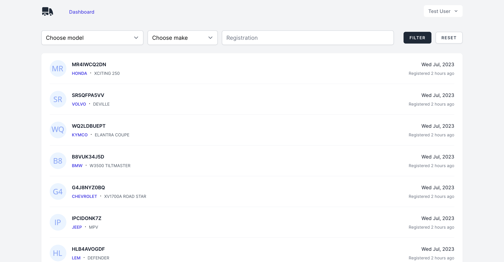
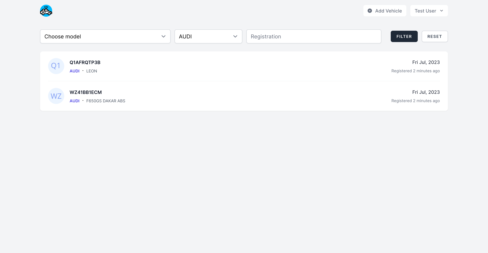
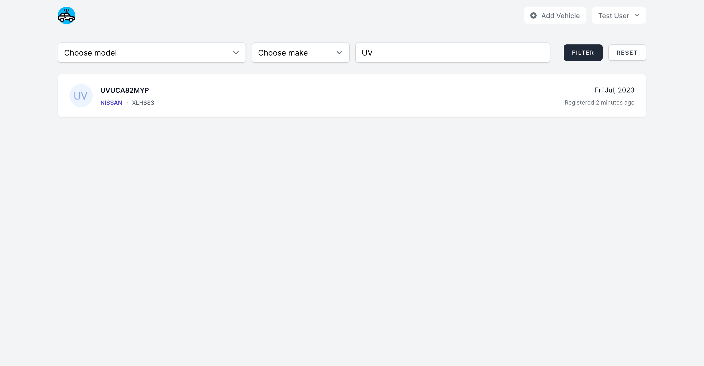
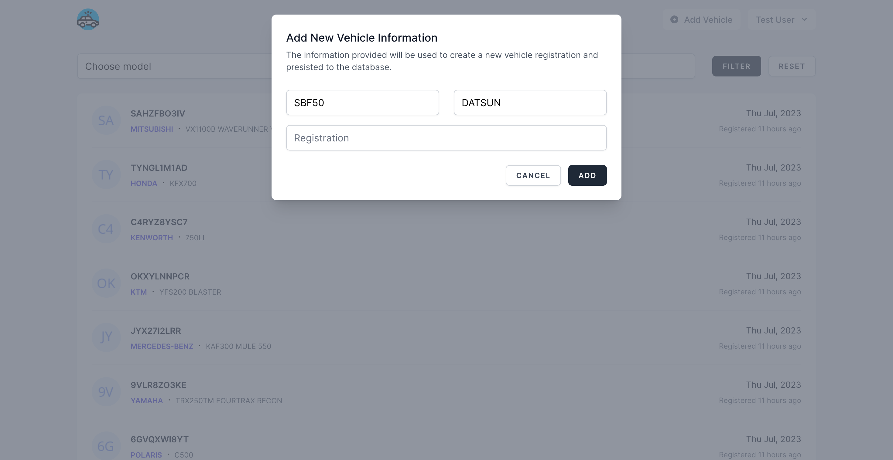
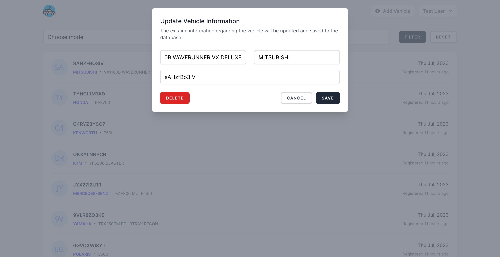

# Transmission



Trasmission is a web application that allows users to search for vehicles by make, model, and registration. The application uses a REST API to retrieve the data. The application UI is built using VueJS and TailwindCSS.

Demo application is hosted on [Fly.io](https://fly.io).
Find the demo application on: <hhttps://transmission.fly.dev>

## Features

### Filter by Make



The app allows users to filter vehicles by make. The user can select a make from the dropdown menu and the app will display all vehicles that match the selected make.

### Filter by Model


The app allows users to filter vehicles by model. The user can select a model from the dropdown menu and the app will display all vehicles that match the selected model.

### Filter by Registration



The app allows users to filter vehicles by registration. The user can enter a registration number and the app will display all vehicles that match the entered registration number.

### Add New Vehicle



The app allows users to add new vehicles. The user can click on the "Add Vehicle" button and enter the vehicle details in the modal. The app will validate the entered data and display any errors. If the data is valid, the app will add the vehicle to the database and display a success message.

### Update Vehicle



The app allows users to edit existing vehicles. The user can click on the "Registration" number of the vehicle to be updated and enter the vehicle details in the modal. The app will validate the entered data and display any errors. If the data is valid, the app will update the vehicle in the database and display a success message.

### Delete Vehicle

The update modal also allows users to delete vehicles. The user can click on the "Delete" button to delete the vehicle.

## Installation

Please check the official laravel installation guide for server requirements before you start. [Official Documentation](https://laravel.com/docs/10.x/installation#installation)

Alternative installation is possible without local dependencies relying on [Docker](#docker).

Clone the repository

```bash
git clone git@github.com:Thavarshan/transmission.git
```

Switch to the repo folder

```bash
cd transmission
```

Install all the dependencies using composer

```bash
composer install
```

Copy the example env file and make the required configuration changes in the .env file

```bash
cp .env.example .env
```

Generate a new application key

```bash
./vendor/bin/sail php artisan key:generate
```

Starting & Stopping Sail

Laravel Sail's `docker-compose.yml` file defines a variety of Docker containers that work together to help you build the application. Each of these containers is an entry within the services configuration of the `docker-compose.yml` file. The `laravel.test` container is the primary application container that will be serving the application.

To start Sail run the following command from your project root:

```bash
./vendor/bin/sail up
```

To start all of the Docker containers in the background, you may start Sail in "detached" mode:

```bash
./vendor/bin/sail up -d
```

To stop all of the containers, you may simply press Control + C to stop the container's execution. Or, if the containers are running in the background, you may use the `stop` command:

```bash
./vendor/bin/sail stop
```

Build the assets using npm

```bash
./vendor/bin/sail npm install && ./vendor/bin/sail npm run build
```

Run the database migrations (**Set the database connection in .env before migrating**) and seeders

```bash
./vendor/bin/sail php artisan migrate:fresh --seed
```

You can now access the server at <http://localhost:3003>

## Usage

### Test User

The database is seeded with a test user which can be used to login to the application.

You may use the following credentials to login:
| Email              | Passsword |
| ------------------ | --------- |
| <test@example.com> | password  |

## Testing

Transmission comes with a full suite of unit and feature tests. The tests may be run using the following commands:

```bash
./vendor/bin/sail php artisan test
```
