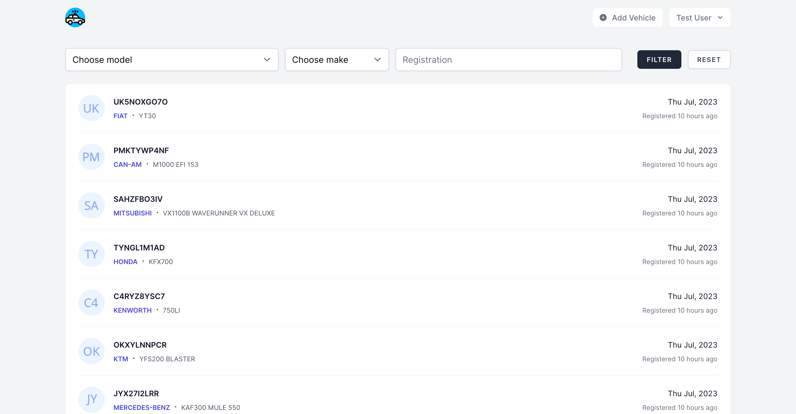
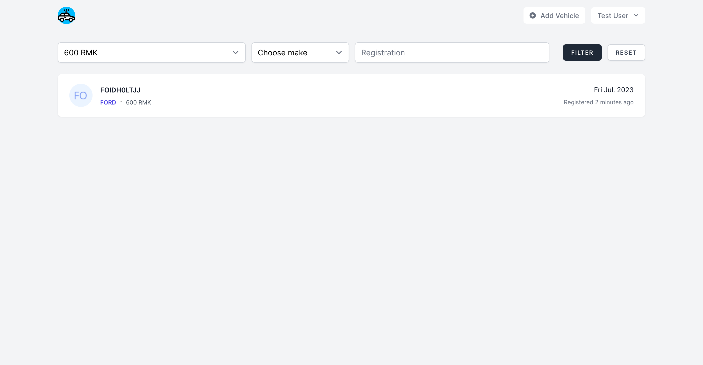

# Transmission



Trasmission is a web application that allows users to search for cars by make, model, and registration. The application uses a REST API to retrieve the data. The application UI is built using VueJS and TailwindCSS.

## Features

### Filter by Make


The app allows users to filter cars by make. The user can select a make from the dropdown menu and the app will display all cars that match the selected make.

### Filter by Model



The app allows users to filter cars by model. The user can select a model from the dropdown menu and the app will display all cars that match the selected model.

### Filter by Registration


The app allows users to filter cars by registration. The user can enter a registration number and the app will display all cars that match the entered registration number.

## Installation

Please check the official laravel installation guide for server requirements before you start. [Official Documentation](https://laravel.com/docs/10.x/installation#installation)

Alternative installation is possible without local dependencies relying on [Docker](#docker).

Clone the repository

```bash
git clone git@github.com:Thavarshan/transmission.git
```

Switch to the repo folder

```bash
cd transmission
```

Install all the dependencies using composer

```bash
composer install
```

Copy the example env file and make the required configuration changes in the .env file

```bash
cp .env.example .env
```

Generate a new application key

```bash
php artisan key:generate
```

Build the assets using npm

```bash
npm install && npm run build
```

Run the database migrations (**Set the database connection in .env before migrating**) and seeders

```bash
php artisan migrate:fresh --seed
```

Start the local development server

```bash
php artisan serve
```

You can now access the server at <http://localhost:8000>

## Usage

### Test User

The database is seeded with a test user which can be used to login to the application.

You may use the following credentials to login:
| Email              | Passsword |
| ------------------ | --------- |
| <test@example.com> | password  |
